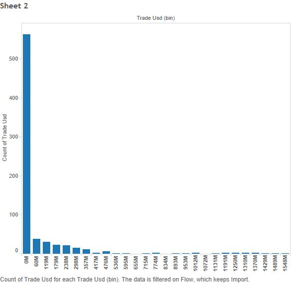
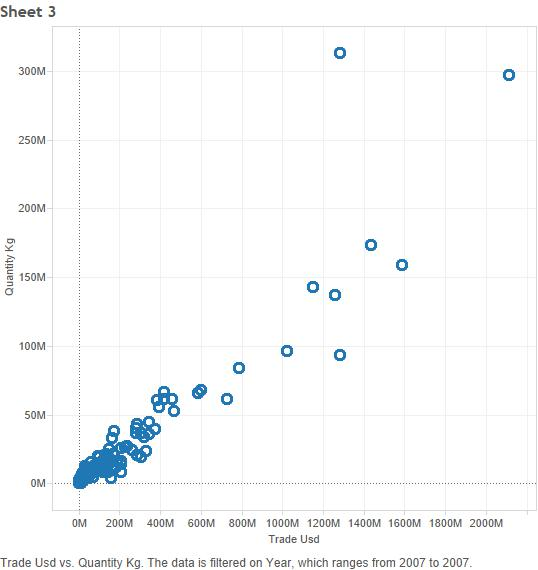

  
#Mohammad Chauhan - Data Visualization Final Project

For the final project, I have chosen data that shows the exported and imported weight in kilograms and total amount in USD of metal commodities for each country. The data for this project was obtained from the United Nations Commodity Trade Statistics off of enigma.io. I will be focusing on three main metals: aluminum, copper, and zinc. I also will be using GDP data for each country. The time frame for this data is 2007-2011. 

-------
To recreate this project, first obtain the necessary data files. Next create a R_ETL.R file for each dataset. After running the R file, newly formatted .csv files will have been made in your directory. Also, copy the CREATE TABLE command in the console to use in sql developer. Run the code in sql developer after connecting to the oracle server. Once the table has been made, import the data into the tables from the formatted files. This will load the information from your datasets into neat tables on the Oracle server.

-------
1. These boxplots show the distribution of the quantity of aluminum in kilograms that was traded in each year. Each graph is filtered by imports and exports and divided up by year from 2007 to 2011.

The graphs displayed below were made using the first step of the Tableau Methodology. 

Aluminum 2007

Aluminum 2008

Aluminum 2009

Aluminum 2010

Aluminum 2011

From these graphs, we can see how the economic downturn affected the importing and exporting of aluminum across the world. To make this graph in Tableau, the Quanitity KG measure is placed into Rows. The columns are divided up by Flow. Lastly, the data is separated by using a filter on Year.

2. The graphs displayed below show a histogram of the total amount of aluminum exported and imported represented in USD across the 5 years chosen. 

The graphs displayed below were made using the second step of the Tableau Methodology. 

Aluminum Import (USD)

Aluminum Export (USD)

From these graphs, we can see that the vast majority of countries in the world fall into the first interval from $0 to $60 million when it comes to aluminum import and export. To make this graph in Tableau, place the Trade USD measure into Rows, then click on histogram. Tableau should create the graph itself. Next, i filtered the data by Flow to get the two graphs.

------
3. For the third set of graphs, I made a scatter plot of quantity of the metal vs the total value for each metal for the years 2007 and 2009. The reason I chose these years was because the recession began in 2007 and ended in 2009. 

The graphs displayed below were made using the third step of the Tableau Methodology.

Aluminum 2007

Aluminum 2009

Copper 2007

Copper 2009

Zinc 2007

Zinc 2009

From these graphs, we are able to see how the recession affected the metals commodities market. From the scatter plot, it is clear that the trade of these metals decreased significantly. To recreate these graphs on Tableau, placee the Trade USD measure into columns, and the Quantity KG measure into rows. Using the dimension Year, we can separate the data by the desired year. Do this for each metal.

-------
4. For this crosstab, I used the GDP data to create a KPI. The data is showing the Quantity_Kg for each country over the five years. The KPI is created so that countries that have a GDP of less than 100,000,000,000 USD, they are considered in the low category, if the GDP is between 100 billion and 1 trillion USD, they are considered in the medium category, and if the country has a GDP higher than 1 trillion USD, they are considered in the high category. The data for 2011 was used.

The graph displayed below was made using the fourth step of the Tableau Methodology.

Aluminum 2011

From this crosstab, we are able to see the relationship between GDP and the quantity of aluminum traded. Some countries export much more than they import and some import more than they export.

--------
5. These last two graphs are bargraphs. They use the data from 2011 for each metal. In this graph, you can see the difference between the metals for each country. One of the graphs is for export and the other is for import. The only countries on this bargraph are those who export and import $10 million or more of each metal. 

The graph displayed below was made using the fifth step of the Tableau Methodology.

Metals 2011 Export

Metals 2011 Import

From these graphs we can compare and contrast the amount of exporting and importing these countries did in 2011. Since the data is cut off at the $10 million mark, the countries that are left are masjority first world, developed countries.